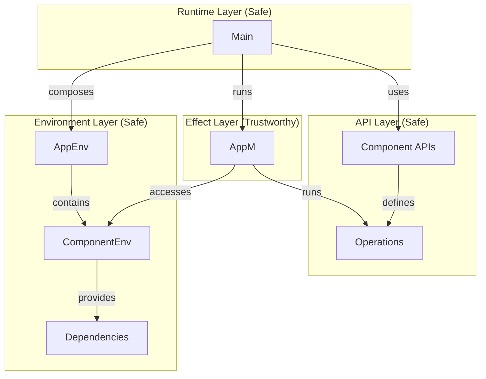
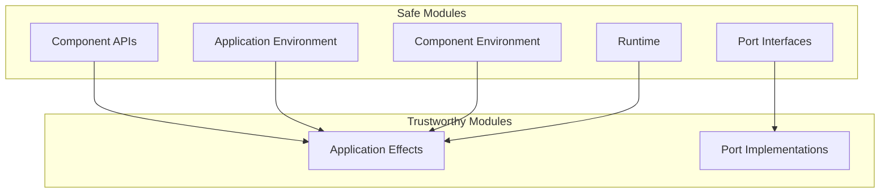
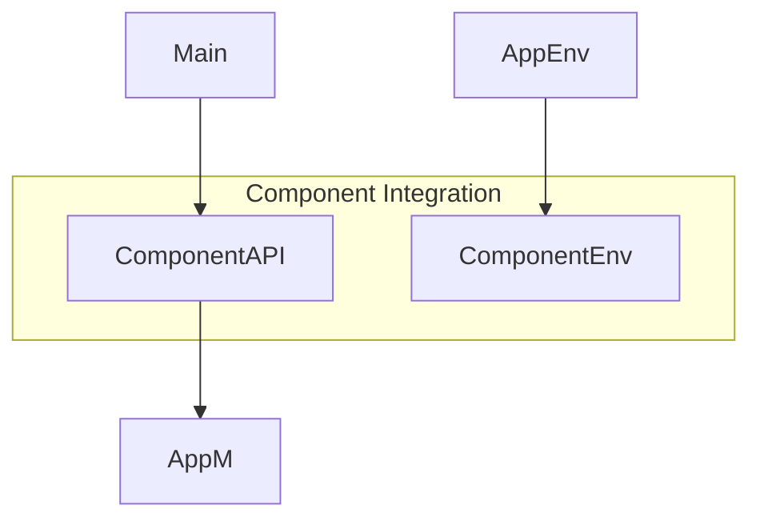
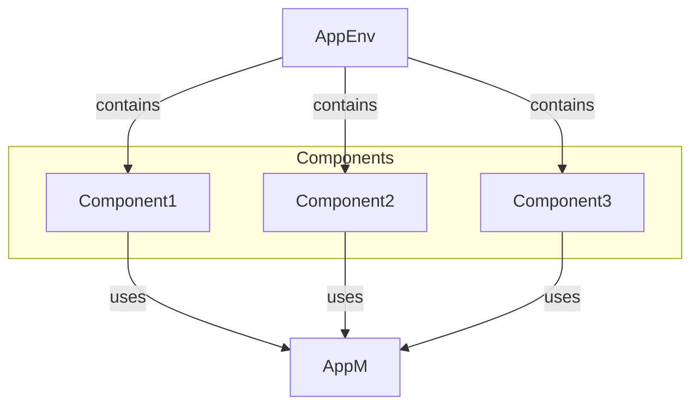

# Application Composition

## Overview

This document outlines our approach to composing type-safe, mathematically verified applications using the ReaderT pattern. It defines patterns for combining component APIs, environments, and effects into a complete, usable application while maintaining safety, testability, and mathematical correctness.

## Table of Contents

1. [Composition Model](#1-composition-model)
2. [Component Integration](#2-component-integration)
3. [Mathematical Properties](#3-mathematical-properties)
4. [Usage Patterns](#4-usage-patterns)
5. [Implementation Requirements](#5-implementation-requirements)
6. [Simplified Effect Management](#6-simplified-effect-management)
7. [Composition Examples](#7-composition-examples)
8. [References](#8-references)

## 1. Composition Model

### A. Layer Structure



### B. Safety Boundaries



## 2. Component Integration

### A. API Design

```haskell
-- Component API (Safe)
module Components.ComponentName.ComponentAPI 
    ( operation  -- Only expose operations
    ) where

-- Operations defined using the application monad directly
-- Note: AppM includes error handling via ExceptT
operation :: Input -> AppM Output
```

### B. Environment Composition

```haskell
-- Application Environment (Safe)
data AppEnv = AppEnv
    { componentEnv :: !ComponentEnv  -- Strict fields
    }

-- Component Environment (Safe)
data ComponentEnv = ComponentEnv
    { envPorts :: !Ports     -- Required ports
    , envConfig :: !Config   -- Configuration
    }
```

### C. Effect Handling

```haskell
-- Application Effects (Trustworthy)
newtype AppM a = AppM 
    { unAppM :: ReaderT AppEnv (ExceptT AppError IO) a 
    }
    deriving (Functor, Applicative, Monad, MonadReader AppEnv, MonadError AppError, MonadIO)
        via (ReaderT AppEnv (ExceptT AppError IO))

-- Component Environment Access
appComponentEnv :: AppEnv -> ComponentEnv
appComponentEnv = componentEnv

-- Error handling pattern
operation :: Input -> AppM Output
operation input = do
    -- Validate inputs
    when (invalidInput input) $
        throwError $ mkAppError "Invalid input" "operation" 
                    (Map.singleton "input" (show input))
    
    -- Access component environment
    env <- asks appComponentEnv
    -- Perform operation
    result <- performOperation env input
    pure result
```

## 3. Mathematical Properties

### A. Composition Laws

```haskell
-- Environment Composition
mkAppEnv . mkComponentEnv = mkFullEnv  -- Total construction

-- Monad Laws for AppM
(return x >>= f) = f x                 -- Left identity
(m >>= return) = m                     -- Right identity
(m >>= f >>= g) = m >>= (\x -> f x >>= g)  -- Associativity

-- Error Handling Laws
throwError e >>= f = throwError e      -- Error propagation
catchError (throwError e) f = f e      -- Error catching
catchError (return x) f = return x     -- Pure value preservation
```

### B. Safety Properties

```haskell
-- Total Construction
mkComponentEnv :: Ports -> Config -> ComponentEnv  -- No partial states

-- Immutable Updates
withPorts :: (Ports -> Ports) -> ComponentEnv -> ComponentEnv
```

## 4. Usage Patterns

### A. Production Composition

```haskell
main :: IO ()
main = do
    -- 1. Compose Environments
    ports <- mkPorts        -- Create required ports
    config <- mkConfig      -- Load configuration
    let componentEnv = mkComponentEnv ports config
        appEnv = mkAppEnv componentEnv
    
    -- 2. Run Application with error handling
    result <- runAppM appEnv $ do
        -- 3. Use Component APIs directly
        output <- operation input
        pure output
        
    -- 4. Handle errors at top level
    case result of
        Right value -> displayResult value
        Left err -> displayError err >> exitFailure
```

### B. Test Composition

```haskell
spec :: Spec
spec = describe "Component" $ do
    it "operates correctly with valid input" $ do
        -- 1. Compose Test Environment
        mockPorts <- mkMockPorts
        testConfig <- mkTestConfig
        let componentEnv = mkComponentEnv mockPorts testConfig
            env = mkAppEnv componentEnv
        
        -- 2. Run Test
        result <- runAppM env $ operation validInput
        
        -- 3. Verify
        result `shouldSatisfy` isRight
        let Right output = result
        output `shouldSatisfy` isValid
        
    it "handles invalid input correctly" $ do
        -- 1. Compose Test Environment
        mockPorts <- mkMockPorts
        testConfig <- mkTestConfig
        let componentEnv = mkComponentEnv mockPorts testConfig
            env = mkAppEnv componentEnv
        
        -- 2. Run Test with invalid input
        result <- runAppM env $ operation invalidInput
        
        -- 3. Verify error handling
        result `shouldSatisfy` isLeft
        let Left err = result
        errorContext err `shouldBe` "operation"
        errorMessage err `shouldContain` "Invalid input"
```

## 5. Implementation Requirements

### A. Safe Modules

1. API Modules:
   - Marked `Safe`
   - Only expose operations
   - No implementation details
   - Type signatures using AppM
   - Document possible error conditions
   - Include example usage

2. Environment Modules:
   - Marked `Safe`
   - Total construction
   - No effects
   - Strict fields
   - Clear accessor functions
   - Document component dependencies

### B. Trustworthy Modules

1. Effect Modules:
   - Marked `Trustworthy`
   - Document unsafe operations
   - Maintain error context
   - Resource safety

2. Runtime Modules:
   - Marked `Safe` (Main.hs is Safe)
   - Handle top-level errors
   - Manage resources
   - Coordinate effects
   - Provide clear user feedback

## 6. Simplified Effect Management

Our application uses a direct `AppM` approach across all components rather than component-specific monads. Building on the implementation requirements outlined in the previous section, this approach further simplifies our code while maintaining all safety and mathematical properties. This section explains the rationale, benefits, and patterns associated with this simplified effect management approach. The concrete implementation of these patterns can be seen in the Composition Examples in Section 7.

### A. Effect Management Principles

The direct `AppM` approach follows these principles:

1. **Single Monad**: Use `AppM` directly for all effectful operations across all components
2. **Environment Access**: Components access their environment through `AppEnv` accessors
3. **No Lifting Required**: Components interact directly without lifting operations
4. **Preserved Boundaries**: Maintain hexagonal architecture through module structure

### B. Benefits of Direct AppM Usage

This simplified approach provides several benefits:

```haskell
-- Mental model simplification
-- One monad for all operations
type AppM a = ExceptT AppError IO a
```

1. **Simplified Mental Model**: One monad for all effects reduces cognitive load
2. **Reduced Complexity**: No lifting operations between component monads
3. **Fewer Modules**: No need for component-specific monad definitions
4. **Better Composition**: Components interact directly and naturally
5. **Flatter Learning Curve**: Easier for new developers to understand

### C. Mathematical Properties

This approach preserves essential mathematical properties:

```haskell
-- All monad laws are preserved
(return x >>= f) = f x                 -- Left identity
(m >>= return) = m                     -- Right identity
(m >>= f >>= g) = m >>= (\x -> f x >>= g)  -- Associativity
```

1. **Functor Laws**: `fmap` behaves identically
2. **Applicative Laws**: `pure` and `<*>` maintain their properties
3. **Monad Laws**: `return` and `>>=` maintain their properties
4. **Error Handling Laws**: Error propagation works identically

### D. API Design Pattern

Component APIs use `AppM` directly in their signatures:

```haskell
-- Direct AppM usage in API
getData :: ResourceId -> UTCTime -> AppM [DataPoint]
getData resourceId endTime = do
    -- Validate inputs
    currentTime <- liftIO getCurrentTime
    when (endTime > currentTime) $
        throwError $ mkAppError 
            "End time cannot be in the future" 
            "getData"
            (Map.fromList 
                [ ("end_time", show endTime)
                , ("current_time", show currentTime)
                ])
    
    -- Access environment components through the AppEnv
    componentEnv <- asks appComponentEnv
    let client = getHttpClient componentEnv
    let config = getHttpConfig componentEnv
    
    -- Perform operations
    response <- liftIO $ executeRequest client config "/data" params
    parseDataPoints response
```

### E. Component Interaction Pattern

Components use other components' APIs directly without lifting:

```haskell
-- Direct component interaction
processResource :: Resource -> AppM ProcessedResource
processResource resource = do
    -- Call other component functions directly - no lifting needed
    metadata <- getMetadata resource.id
    
    -- Process resource with metadata
    pure $ calculateProcessedResource resource metadata
```

### F. Testing Pattern

Testing becomes more straightforward with helper functions:

```haskell
-- Test with AppM directly
spec :: Spec
spec = describe "getData" $ do
    it "retrieves data for valid resource" $ do
        -- Create mock environment
        mockClient <- createMockHttpClient
        let config = defaultTestConfig
        let componentEnv = mkComponentEnv mockClient config
        
        -- Create minimal AppEnv with just what we need
        let appEnv = mkTestEnv componentEnv
        
        -- Run with AppM directly
        result <- runAppM appEnv $ getData "resource-123" someTime
        
        -- Verify results
        case result of
            Right dataPoints -> length dataPoints `shouldBe` 20
            Left err -> expectationFailure $ "Failed: " ++ show err
```

### G. Architectural Alignment

This approach maintains our hexagonal architecture:

1. **Pure Core**: Domain logic remains pure
2. **Effectful Shell**: Effects are still pushed to boundaries
3. **Component Boundaries**: Maintained through module structure
4. **Environment Isolation**: Each component only accesses its own environment portion

The simplified approach flattens effect handling without changing the architectural boundaries, maintaining the same level of component isolation where it matters most.

## 7. Composition Examples

The following examples illustrate how the simplified effect management principles from the previous section are applied in practice. These diagrams show the concrete relationships between components, the shared `AppM` monad, and the application environment.

### A. Single Component



### B. Multiple Components



## 8. References

1. [architecture.md](architecture.md) - Overall architectural patterns
2. [formal-system-specification.md](formal-system-specification.md) - Mathematical foundations
3. [operational-context.md](operational-context.md) - System constraints
4. [idiomatic-error-handling.md](idiomatic-error-handling.md) - Error handling approach

## 9. Concrete Implementation Examples

This section provides references to specific files in our project that implement the patterns described in this document.

### A. Application Environment

Our [src/Config/AppEnv.hs](src/Config/AppEnv.hs) module implements the Environment Layer:

```haskell
-- | Application-wide environment containing all component environments.
-- This is a pure record type with no effects.
data AppEnv = AppEnv
  { 
    -- Component environments would be added here
    exampleEnv :: !ExampleComponentEnv
  }

-- | Smart constructor for AppEnv
mkAppEnv :: ExampleComponentEnv -> AppEnv
mkAppEnv cEnv =
  AppEnv
    { exampleEnv = cEnv
    }

-- | Access component environment
appExampleEnv :: AppEnv -> ExampleComponentEnv
appExampleEnv = exampleEnv
```

### B. Application Monad

Our [src/Config/AppM.hs](src/Config/AppM.hs) module implements the Effect Layer:

```haskell
-- | Application monad transformer stack for effect handling
-- Combines ReaderT for environment access with ExceptT for error handling
newtype AppM r a = AppM
  { unAppM :: TR.ReaderT r (ExceptT AppError IO) a
  }
  deriving
    (Functor, Applicative, Monad, MonadIO, MonadReader r)
    via (TR.ReaderT r (ExceptT AppError IO))

-- | Run an AppM computation with the given environment
runAppM :: AppEnv -> AppM AppEnv a -> IO (Either AppError a)
runAppM env (AppM m) = runExceptT $ TR.runReaderT m env
```

### C. Error Handling

Our [src/Control/Error.hs](src/Control/Error.hs) module implements the error handling approach:

```haskell
-- | Create a new error with context and automatic callstack capture
mkAppError ::
  (HasCallStack) =>
  -- | Error message (guaranteed non-empty)
  NonEmptyText ->
  -- | Context (function name)
  NonEmptyText ->
  -- | Error details
  Map NonEmptyText NonEmptyText ->
  AppError
```

### D. Verified Data Types

Our [src/Data/NonEmptyText.hs](src/Data/NonEmptyText.hs) and [src/Data/VerifiedText.hs](src/Data/VerifiedText.hs) modules demonstrate how to implement domain types with LiquidHaskell refinements.

### E. Testing

The [test/Control/ErrorPropertySpec.hs](test/Control/ErrorPropertySpec.hs) file shows how we test our error handling implementation with property-based tests.

By following the guidance in this document and referencing these concrete implementations, you can extend the application with new components while maintaining the safety, testability, and mathematical properties that make our architecture robust.

