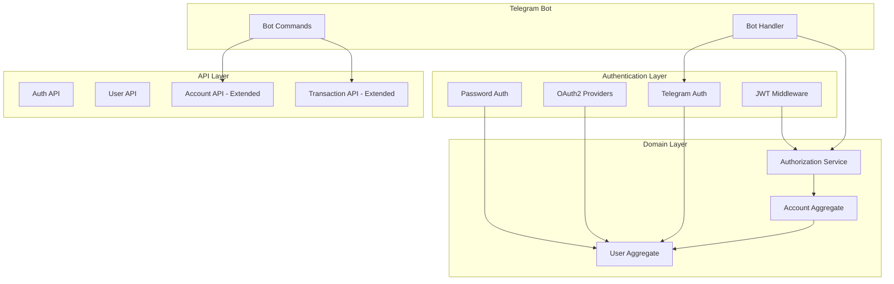

# User Management Implementation Plan

## Overview

Add user management to the accounting system with multi-provider authentication (password, OAuth2, Telegram), Role-Based Access Control (RBAC), and Telegram bot integration. All **user-facing** money movements use transfers only (double-entry model) — users never issue direct credit/debit commands. Internally, the TransferManager process manager (saga) coordinates `DebitAccount` and `CreditAccount` commands on Account aggregates to implement the double-entry accounting with proper failure compensation. Each user gets an auto-created "External" account for recording income and expenses.

## Architecture



## Domain Model

### Core Types (extend `src/Domain/Core/Types.hs`)

```haskell
newtype UserId = UserId { unUserId :: UUID }
newtype TelegramId = TelegramId { unTelegramId :: Int64 }

-- Role-Based Access Control
data AccountRole = Owner | Editor | Viewer
  deriving (Show, Eq, Ord)

data AccountAccess = AccountAccess
  { accessUserId :: UserId
  , accessRole :: AccountRole
  }

-- Account types for transfer-only model
data AccountType 
  = RegularAccount   -- User-created accounts (Checking, Savings, Cash)
  | ExternalAccount  -- System-created, one per user, for income/expenses
  deriving (Show, Eq)

data OAuthProvider = Google | GitHub | Microsoft

data OAuthIdentity = OAuthIdentity
  { oauthProvider :: OAuthProvider
  , oauthSubject :: Text
  }

data TelegramIdentity = TelegramIdentity
  { telegramId :: TelegramId
  , telegramUsername :: Maybe Text
  , telegramFirstName :: Text
  }
```

### Role Permissions Matrix

| Permission | Owner | Editor | Viewer |
|---|---|---|---|
| View account balance | Yes | Yes | Yes |
| View transaction history | Yes | Yes | Yes |
| Transfer (as source/target) | Yes | Yes | No |
| Share account (grant access) | Yes | No | No |
| Revoke access | Yes | No | No |
| Delete account | Yes | No | No |

### Transfer-Only Model (Double-Entry)

All **user-facing** money movements are transfers between two accounts. Users issue `InitiateTransfer` only — the TransferManager saga internally handles `DebitAccount`/`CreditAccount` commands.

**Recording Income:**

```
Transfer: External Account → Checking Account (amount: 5000, reason: "Salary")
```

**Recording Expense:**

```
Transfer: Checking Account → External Account (amount: 150, reason: "Groceries")  
```

**Moving Money Between Accounts:**

```
Transfer: Checking Account → Savings Account (amount: 1000, reason: "Monthly savings")
```

The External account is auto-created when a user registers and acts as the "outside world" - money comes from it (income) or goes to it (expenses).

### Authorization Rules

**Account Access:**

- User can access account if they appear in the account's access list (any role)
- Unauthorized access returns 404 (hide account existence)
- External accounts are only visible to their owner (not shareable)

**Transfer Authorization:**

- User must have Editor or Owner role on BOTH source and target accounts
- Self-transfer (same account) is rejected
- User always has implicit Editor access to their own External account

## Implementation Phases

### Phase 1: User Domain

New files in `src/Domain/User/`:

- `Commands.hs` - RegisterUser, RegisterViaTelegram, LinkOAuthAccount, LinkTelegramAccount, UnlinkOAuthAccount, UnlinkTelegramAccount, ChangePassword
- `Events.hs` - UserRegistered, UserRegisteredViaTelegram, OAuthAccountLinked, TelegramAccountLinked, PasswordChanged
- `Projection.hs` - User aggregate state (includes reference to External account)
- `CommandHandler.hs` - Business rules
- `Errors.hs` - UserNotFound, EmailAlreadyExists, TelegramAlreadyLinked, InvalidCredentials

Key design:

- Email is primary identifier for web login
- Telegram ID is primary identifier for bot login
- Password stored as Argon2 hash (optional if registered via Telegram)
- Multiple OAuth accounts can link to one user
- One Telegram account per user
- **External account auto-created on user registration** (for income/expense tracking)

### Phase 2: Account Ownership, RBAC, and External Accounts

Modify `src/Domain/Account/Commands.hs`:

```haskell
data CreateAccount = CreateAccount
  { createAccountName :: Text
  , createAccountInitialBalance :: Money
  , createAccountCreatedBy :: UserId  -- NEW: Owner
  , createAccountType :: AccountType  -- NEW: Regular or External
  }

-- NEW: Share account with another user
data ShareAccount = ShareAccount
  { shareAccountUserId :: UserId
  , shareAccountRole :: AccountRole
  , shareAccountGrantedBy :: UserId
  }

-- NEW: Revoke access
data RevokeAccountAccess = RevokeAccountAccess
  { revokeAccountUserId :: UserId
  , revokeAccountRevokedBy :: UserId
  }
```

**Keep in Commands.hs (internal saga commands):**

- `DebitAccount` command — used internally by the TransferManager process manager (saga) to debit the source account. Not exposed via user-facing API.
- `CreditAccount` command — used internally by the TransferManager process manager (saga) to credit the target account. Not exposed via user-facing API.

> **Important distinction:** The "transfer-only model" applies to the *user-facing API* — users only issue `InitiateTransfer`. Internally, the TransferManager saga coordinates `DebitAccount` → `CreditAccount` → `CompleteTransfer` commands to implement double-entry accounting with proper compensation on failure.

Modify `src/Domain/Account/Events.hs`:

```haskell
data AccountCreated = AccountCreated
  { accountCreatedName :: Text
  , accountCreatedInitialBalance :: Money
  , accountCreatedBy :: UserId     -- NEW
  , accountCreatedType :: AccountType  -- NEW
  }

-- NEW: Access granted event
data AccountAccessGranted = AccountAccessGranted
  { accessGrantedUserId :: UserId
  , accessGrantedRole :: AccountRole
  , accessGrantedBy :: UserId
  }

-- NEW: Access revoked event
data AccountAccessRevoked = AccountAccessRevoked
  { accessRevokedUserId :: UserId
  , accessRevokedBy :: UserId
  }
```

**Keep in Events.hs (internal saga events):**

- `AccountDebited` — emitted by Account aggregate when `DebitAccount` succeeds. Carries `TransactionId` for saga correlation.
- `AccountCredited` — emitted by Account aggregate when `CreditAccount` succeeds. Carries `TransactionId` for saga correlation.
- `AccountDebitRejected` — emitted when `DebitAccount` fails (e.g., insufficient funds on RegularAccount). Triggers compensation (FailTransfer).

> These events are **not** triggered by user actions directly. They are part of the internal saga coordination between the TransferManager process manager and the Account aggregate.

Modify `src/Domain/Account/Projection.hs`:

```haskell
data Account = Account
  { _accountBalance :: Money
  , _accountName :: Text
  , _accountCreatedBy :: UserId           -- NEW: Owner
  , _accountType :: AccountType           -- NEW: Regular or External
  , _accountAccessList :: [AccountAccess] -- NEW: RBAC
  }
```

**Business Rules:**

- Creator automatically gets Owner role in access list
- Owner cannot be removed from access list
- Only Owner can grant/revoke access
- User can only have one role per account (granting new role replaces old)
- External accounts cannot be shared (only owner can access)
- External accounts allow negative balances (money "comes from" external world)
- One External account auto-created per user during registration

### Phase 3: Transfer-Only Model (User-Facing) with Internal Saga

All **user-facing** money movements use transfers. Users only issue `InitiateTransfer` — the TransferManager process manager (saga) internally coordinates account debit/credit operations.

> **Clarification:** "Transfer-only" means the user-facing API has no standalone credit/debit endpoints. Internally, `DebitAccount` and `CreditAccount` commands are issued by the saga to implement the double-entry accounting flow. See [2026-02-11-transfer-saga-implementation.md](./2026-02-11-transfer-saga-implementation.md) for the full saga design.

Modify `src/Domain/Transaction/Events.hs`:

```haskell
data TransferInitiated = TransferInitiated
  { transferInitiatedFromAccountId :: AccountId
  , transferInitiatedToAccountId :: AccountId
  , transferInitiatedAmount :: Money
  , transferInitiatedReason :: Text
  , transferInitiatedBy :: UserId  -- NEW: Audit trail
  }
```

Modify `src/Domain/Transaction/Commands.hs`:

```haskell
data InitiateTransfer = InitiateTransfer
  { initiateTransferFromAccountId :: AccountId
  , initiateTransferToAccountId :: AccountId
  , initiateTransferAmount :: Money
  , initiateTransferReason :: Text
  , initiateTransferBy :: UserId  -- NEW: Who initiated
  }
```

**Transfer Saga Flow (orchestrated by TransferManager process manager):**

1. User issues `InitiateTransfer` → `TransferInitiated` event emitted
2. Saga issues `DebitAccount` to source account
3. On `AccountDebited` → Saga issues `CreditAccount` to target + `CompleteTransfer` to transaction
4. On `AccountDebitRejected` → Saga issues `FailTransfer` with reason (compensation)
5. On `AccountCredited` → Saga cleans up tracking (transfer complete)

**Transfer Business Rules:**

- Transfers from External → Regular = Income (increases Regular balance)
- Transfers from Regular → External = Expense (decreases Regular balance)
- Transfers between Regular accounts = Internal movement
- Source account must have sufficient balance (except External accounts)
- External accounts can go negative (they represent "outside world")
- Balance sufficiency is enforced at the Account aggregate level via `DebitAccount` command handler

### Phase 4: Authorization Service

New file `src/Application/Services/AuthorizationService.hs`:

```haskell
data AccountAccessResult
  = AccessGranted AccountRole
  | AccessDenied

canAccessAccount
  :: UserId
  -> AccountId
  -> AppM AccountAccessResult

-- Check if user can perform write operations (Editor+)
canModifyAccount
  :: UserId
  -> AccountId
  -> AppM Bool

-- Check if user can manage account (Owner only)
canManageAccount
  :: UserId
  -> AccountId
  -> AppM Bool

-- Transfer authorization: needs Editor+ on both accounts
canTransfer
  :: UserId
  -> AccountId  -- Source
  -> AccountId  -- Target
  -> AppM TransferAuthResult

data TransferAuthResult
  = TransferAuthorized
  | TransferDenied TransferDenialReason

data TransferDenialReason
  = NoAccessToSource
  | NoAccessToTarget
  | InsufficientRoleOnSource AccountRole
  | InsufficientRoleOnTarget AccountRole

-- Get all accounts user can access
getUserAccessibleAccounts
  :: UserId
  -> AppM [(AccountId, AccountRole)]
```

### Phase 5: Authentication Infrastructure

Files in `src/Infrastructure/Auth/`:

**`Password.hs`** - Argon2 hashing:

```haskell
hashPassword :: Text -> IO PasswordHash
verifyPassword :: Text -> PasswordHash -> Bool
```

**`JWT.hs`** - Token management:

```haskell
data JWTClaims = JWTClaims
  { jwtUserId :: UserId
  , jwtEmail :: Text
  , jwtExpiry :: UTCTime
  }

generateToken :: UserId -> Text -> AppM Text
verifyToken :: Text -> AppM (Maybe JWTClaims)
```

**`OAuth.hs`** - Provider integration (Google, GitHub, Microsoft):

```haskell
data OAuthConfig = OAuthConfig
  { oauthClientId :: Text
  , oauthClientSecret :: Text
  , oauthRedirectUri :: Text
  }

getAuthorizationUrl :: OAuthProvider -> AppM Text
handleOAuthCallback :: OAuthProvider -> Text -> AppM OAuthUserInfo
```

**`Telegram.hs`** - Telegram authentication:

```haskell
data TelegramConfig = TelegramConfig
  { telegramBotToken :: Text
  , telegramBotUsername :: Text
  }

verifyTelegramAuth :: TelegramAuthData -> AppM Bool
authenticateViaTelegram :: TelegramIdentity -> AppM (UserId, Bool)
```

### Phase 6: Read Models

Extend `src/Application/ReadModels/AccountSummary.hs`:

```haskell
data AccountSummary = AccountSummary
  { accountSummaryId :: AccountId
  , accountSummaryName :: Text
  , accountSummaryBalance :: Money
  , accountSummaryCreatedBy :: UserId    -- NEW
  , accountSummaryType :: AccountType    -- NEW
  , accountSummaryAccessList :: [AccountAccess]  -- NEW
  , accountSummaryUserRole :: Maybe AccountRole  -- NEW: Requesting user's role
  }
```

New `src/Application/ReadModels/UserSummary.hs`:

- User profile data
- Linked OAuth accounts
- Linked Telegram account

### Phase 7: Telegram Bot

Files in `src/Telegram/`:

- `Bot.hs` - Bot initialization
- `Commands.hs` - /start, /login, /accounts, /balance, /transfer, /income, /expense, /help
- `Keyboards.hs` - Inline keyboards (account selection)
- `Conversations.hs` - Multi-step flows
- `Types.hs` - Telegram-specific types

Bot commands:

- `/start` - Welcome, signup if new user (creates External account)
- `/login` - Link Telegram to existing account
- `/accounts` - List user's accounts
- `/balance` - Show account balances
- `/transfer` - Transfer between accounts (multi-step)
- `/income` - Quick income: External → selected account
- `/expense` - Quick expense: selected account → External
- `/help` - Show available commands

### Phase 8: API Layer

**Auth API** (`src/Web/API/AuthAPI.hs`):

- `POST /api/auth/register` - Email + password registration
- `POST /api/auth/login` - Email + password login
- `GET /api/auth/oauth/:provider` - Initiate OAuth flow
- `GET /api/auth/oauth/:provider/callback` - OAuth callback
- `POST /api/auth/link-oauth` - Link OAuth to existing account
- `POST /api/auth/telegram` - Verify Telegram login widget and authenticate
- `POST /api/auth/link-telegram` - Link Telegram to existing account
- `POST /api/auth/refresh` - Refresh JWT token

**Telegram Bot Webhook** (`src/Web/API/TelegramWebhookAPI.hs`):

- `POST /api/telegram/webhook` - Receive Telegram bot updates (production)

**User API** (`src/Web/API/UserAPI.hs`):

- `GET /api/users/me` - Current user profile
- `PUT /api/users/me` - Update profile
- `POST /api/users/me/change-password` - Change password
- `DELETE /api/users/me/oauth/:provider` - Unlink OAuth
- `DELETE /api/users/me/telegram` - Unlink Telegram account

**Account API** (modify `src/Web/API/AccountAPI.hs`):

- `POST /api/accounts` - Create (user becomes Owner)
- `GET /api/accounts` - List accessible accounts (with user's role, includes External)
- `GET /api/accounts/:id` - Get details (404 if no access)
- `POST /api/accounts/:id/access` - Grant access (Owner only, not for External)
- `DELETE /api/accounts/:id/access/:userId` - Revoke (Owner only)

**Removed user-facing endpoints** (internal saga handles these automatically):

- ~~`POST /api/accounts/:id/credit`~~ - Use transfer from External instead (saga issues `CreditAccount` internally)
- ~~`POST /api/accounts/:id/debit`~~ - Use transfer to External instead (saga issues `DebitAccount` internally)

**Transaction API** (modify existing):

- `POST /api/transactions/` - Requires Editor+ on both accounts
- `GET /api/transactions/:id` - Requires access to source or target
- `GET /api/transactions` - List transfers for accessible accounts (with filters)

### Phase 9: Auth Middleware

`src/Web/Middleware/Auth.hs`:

```haskell
authMiddleware :: Middleware
getCurrentUser :: AppM (Maybe UserId)
requireAuth :: AppM UserId
```

### Phase 10: Testing

- Unit tests for RBAC authorization rules (property-based)
- Unit tests for role permission checks
- Unit tests for password hashing
- Unit tests for Telegram auth verification
- Integration tests for OAuth flow
- Integration tests for Telegram bot commands
- Integration tests for protected endpoints
- Tests verifying users cannot access accounts without role
- Tests verifying Viewer cannot initiate transfers
- Tests for sharing/revoking access flows
- Tests for External account auto-creation on registration
- Tests for income transfers (External → Regular)
- Tests for expense transfers (Regular → External)
- Tests verifying External accounts allow negative balances
- Tests verifying External accounts cannot be shared

## Configuration Changes

Add to `config/test.yaml`:

> **Note (2026-04-17):** The `${TELEGRAM_WEBHOOK_URL}` reference below reflects the design as originally written. That env var is no longer set by the operator — the Telegram webhook URL is derived from `${API_BASE_URL}` in `config/prod.yaml`. See `docs/specs/2026-04-17-api-base-url-derived-urls-design.md` for the current layout.

```yaml
auth:
  jwtSecret: ${JWT_SECRET}
  jwtExpirySeconds: 3600
  
oauth:
  google:
    clientId: ${GOOGLE_CLIENT_ID}
    clientSecret: ${GOOGLE_CLIENT_SECRET}
    redirectUri: http://localhost:8080/api/auth/oauth/google/callback
  github:
    clientId: ${GITHUB_CLIENT_ID}
    clientSecret: ${GITHUB_CLIENT_SECRET}
    redirectUri: http://localhost:8080/api/auth/oauth/github/callback
  microsoft:
    clientId: ${MICROSOFT_CLIENT_ID}
    clientSecret: ${MICROSOFT_CLIENT_SECRET}
    redirectUri: http://localhost:8080/api/auth/oauth/microsoft/callback

telegram:
  botToken: ${TELEGRAM_BOT_TOKEN}
  botUsername: ${TELEGRAM_BOT_USERNAME}
  webhookUrl: ${TELEGRAM_WEBHOOK_URL}
  usePolling: true
```

## Dependencies to Add

```yaml
# package.yaml
dependencies:
  - jose
  - password
  - http-client
  - http-client-tls
  - uri-encode
  - telegram-bot-simple
  - cryptonite
```

## Security Considerations

- Argon2id for password hashing (memory-hard, resistant to GPU attacks)
- JWT with RS256 or HS256 with strong secret
- OAuth state parameter to prevent CSRF
- Rate limiting on auth endpoints
- Return 404 for unauthorized access (hide existence)

## Related

- User Management & Auth: [docs/prompts/2026-01-30-user-management.md](../prompts/2026-01-30-user-management.md)
- Main Plan: [docs/plans/2025-12-01-account-backend.md](./2025-12-01-account-backend.md)
- Documentation Management: [.cursor/rules/documentation-management.mdc](../../.cursor/rules/documentation-management.mdc)
