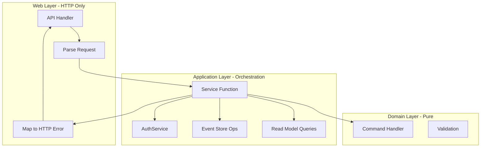

# API to Services Layer Refactoring

## Overview

Extract business orchestration logic from Web/API handlers into Application/Services layer, keeping Web layer thin (HTTP concerns only) while Services handle use case orchestration.

## Current Problem

The Web/API handlers (`src/Web/API/AccountAPI.hs`, `src/Web/API/TransactionAPI.hs`, etc.) mix HTTP concerns with business orchestration:

```haskell
-- Current: 60+ lines mixing concerns
initiateTransferHandler :: TransferRequest -> AppM TransactionResponse
initiateTransferHandler request = do
  transactionUuid <- liftIO UUID.nextRandom           -- orchestration
  transactionId <- case mkTransactionId transactionUuid of  -- orchestration
    Left err -> throwIO $ err500 {...}                -- HTTP mapping
  -- ... 40 more lines mixing both
```

## Target Architecture



## New Module Structure

```
src/Application/Services/
├── AccountService.hs        # NEW - Account use case orchestration
├── TransactionService.hs    # NEW - Transfer use case orchestration
├── AuthService.hs           # NEW - Authentication + Authorization (merged)
└── UserService.hs           # NEW - User profile orchestration
```

Note: `AuthorizationService.hs` will be merged into `AuthService.hs` to consolidate all auth-related logic.

## Service Design Pattern

Following idiomatic error handling: pure validation returns `Either AppError a`, effectful operations use `AppM`.

```haskell
-- Application/Services/TransactionService.hs
module Application.Services.TransactionService
  ( -- * Service Functions
    initiateTransfer,
    getTransaction,
    
    -- * Result Types
    InitiateTransferResult(..),
  ) where

-- Result type for service operations
data InitiateTransferResult = InitiateTransferResult
  { resultTransactionId :: TransactionId
  , resultSummary :: TransactionSummaryData
  }

-- Service function: orchestrates the use case
initiateTransfer ::
  AccountId ->        -- validated source
  AccountId ->        -- validated target  
  Money ->            -- validated amount
  Maybe Text ->       -- reason
  AppM (Either AppError InitiateTransferResult)
initiateTransfer fromId toId amount reason = do
  -- Generate IDs
  transactionUuid <- liftIO UUID.nextRandom
  case mkTransactionId transactionUuid of
    Left err -> return $ Left err
    Right transactionId -> do
      -- Build and execute command
      let cmd = InitiateTransfer {...}
      writer <- view eventStoreWriterL
      reader <- view eventStoreReaderL
      events <- liftIO $ applyTransactionCommand writer reader transactionUuid cmd
      
      -- Query result
      readModel <- view transactionSummaryReadModelL
      maybeSummary <- liftIO $ getTransactionSummary readModel transactionId
      case maybeSummary of
        Just summary -> return $ Right $ InitiateTransferResult transactionId summary
        Nothing -> return $ Left $ mkAppError "Inconsistent state" ...
```

## Thin Web Handler Pattern

```haskell
-- Web/API/TransactionAPI.hs (after refactor)
initiateTransferHandler :: TransferRequest -> AppM TransactionResponse
initiateTransferHandler request = do
  -- 1. Parse and validate request (pure)
  (fromId, toId, amount) <- parseTransferRequest request
    `orThrowHttp` badRequest
  
  -- 2. Delegate to service
  result <- TransactionService.initiateTransfer fromId toId amount (transferReason request)
  
  -- 3. Map result to HTTP
  case result of
    Right r -> return $ fromTransactionSummary (resultTransactionId r) (resultSummary r)
    Left err -> throwHttpError err
```

## Implementation Steps

### Phase 1: Create Service Modules

1. **Create `AccountService.hs`** - Extract from `src/Web/API/AccountAPI.hs`:
   - `createAccount :: Text -> Maybe Money -> AppM (Either AppError AccountResult)`
   - `getAccount :: AccountId -> AppM (Either AppError AccountSummaryData)`
   - `listAccounts :: AppM [AccountSummaryData]`
   - `creditAccount :: AccountId -> Money -> Text -> AppM (Either AppError AccountSummaryData)`
   - `debitAccount :: AccountId -> Money -> Text -> AppM (Either AppError AccountSummaryData)`

2. **Create `TransactionService.hs`** - Extract from `src/Web/API/TransactionAPI.hs`:
   - `initiateTransfer :: AccountId -> AccountId -> Money -> Maybe Text -> AppM (Either AppError TransferResult)`
   - `getTransaction :: TransactionId -> AppM (Maybe TransactionSummaryData)`

3. **Create `AuthService.hs`** - Merge `AuthorizationService.hs` + implement auth stubs:
   
   **Authentication functions** (from `src/Web/API/AuthAPI.hs` stubs):
   - `register :: Email -> Password -> AppM (Either AppError AuthResult)`
   - `login :: Email -> Password -> AppM (Either AppError AuthResult)`
   - `authenticateTelegram :: TelegramAuthData -> AppM (Either AppError AuthResult)`
   - `refreshToken :: RefreshToken -> AppM (Either AppError AuthResult)`
   
   **Authorization functions** (from `AuthorizationService.hs`):
   - `canAccessAccount :: UserId -> AccountAuthData -> AccountAccessResult`
   - `canModifyAccount :: UserId -> AccountAuthData -> Bool`
   - `canManageAccount :: UserId -> AccountAuthData -> Bool`
   - `canTransfer :: UserId -> AccountAuthData -> AccountAuthData -> AccountId -> AccountId -> TransferAuthResult`
   - `getUserAccessibleAccounts :: UserId -> TVar AccountAccessReadModel -> m [(AccountId, AccountRole)]`
   - `checkAccountAccess :: UserId -> AccountId -> TVar AccountAccessReadModel -> m (Maybe (AccountRole, AccountAuthData))`

4. **Create `UserService.hs`** - Implement stubs from `src/Web/API/UserAPI.hs`:
   - `getProfile :: UserId -> AppM (Either AppError UserProfile)`
   - `updateProfile :: UserId -> UpdateProfileData -> AppM (Either AppError UserProfile)`
   - `changePassword :: UserId -> Text -> Text -> AppM (Either AppError ())`

### Phase 2: Refactor API Handlers

Update each API module to become thin HTTP adapters:

1. **`AccountAPI.hs`**: Remove orchestration, delegate to `AccountService`
2. **`TransactionAPI.hs`**: Remove orchestration, delegate to `TransactionService`
3. **`AuthAPI.hs`**: Replace stubs with calls to `AuthService`
4. **`UserAPI.hs`**: Replace stubs with calls to `UserService`

### Phase 3: Migrate AuthorizationService

1. Move all types and functions from `AuthorizationService.hs` into `AuthService.hs`
2. Update all imports across the codebase that reference `AuthorizationService`
3. Delete `src/Application/Services/AuthorizationService.hs`

### Phase 4: Add HTTP Error Mapping

Create helper module for consistent error mapping:

```haskell
-- Web/ErrorMapping.hs
mapServiceError :: AppError -> ServerError
mapServiceError err = case errorContext err of
  ctx | "not found" `isInfixOf` errorMessage err -> err404 {...}
  ctx | "validation" `isInfixOf` errorContext err -> err400 {...}
  _ -> err500 {...}
```

### Phase 5: Update Exports

Update `src/Application/Services.hs` to re-export new services (removing `AuthorizationService`).

## Files to Create

| File | Purpose |
|------|---------|
| `src/Application/Services/AccountService.hs` | Account use case orchestration |
| `src/Application/Services/TransactionService.hs` | Transfer use case orchestration |
| `src/Application/Services/AuthService.hs` | Authentication + Authorization (merged) |
| `src/Application/Services/UserService.hs` | User profile orchestration |
| `src/Web/ErrorMapping.hs` | HTTP error mapping helpers |

## Files to Modify

| File | Changes |
|------|---------|
| `src/Web/API/AccountAPI.hs` | Thin handlers calling AccountService |
| `src/Web/API/TransactionAPI.hs` | Thin handlers calling TransactionService |
| `src/Web/API/AuthAPI.hs` | Replace stubs with AuthService calls |
| `src/Web/API/UserAPI.hs` | Replace stubs with UserService calls |
| `src/Application/Services.hs` | Re-export new service modules |

## Files to Delete

| File | Reason |
|------|--------|
| `src/Application/Services/AuthorizationService.hs` | Merged into AuthService.hs |

## Testing Strategy

1. **Unit tests for services**: Test business logic without HTTP concerns
2. **Integration tests**: Existing tests continue working (same behavior)
3. **Property tests**: Add property tests for service validation logic
4. **Update AuthorizationService tests**: Move to AuthService tests

## Benefits

- **Testability**: Services can be unit tested without HTTP machinery
- **Reusability**: Telegram bot can use same services
- **Maintainability**: Clear separation of concerns
- **Consolidation**: Single AuthService for all auth-related logic

## Related

- [Architecture](../architecture.md)
- [User Management Plan](./2026-01-30-user-management.md)
